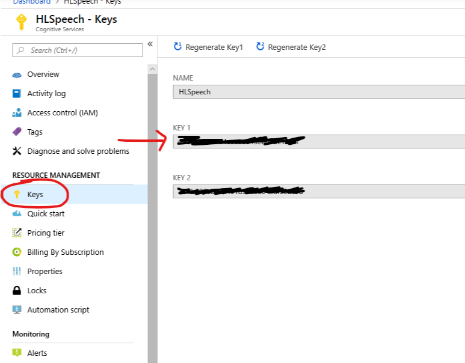
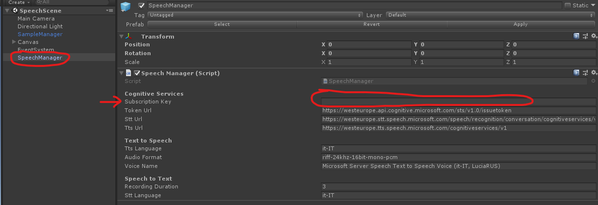

# UnitySpeechManager
Unity3d component for Microsoft Speech APIs.

This project is aimed to demonstrate how to use Microsoft Speech APIs in Unity3d.

To setup the sample, you have to create a Speech resource in your Azure subscription in order to generate a valid key

and copy the KEY 1 (or KEY 2) value in the "Subscription Key" field of SpeechManager prefab
